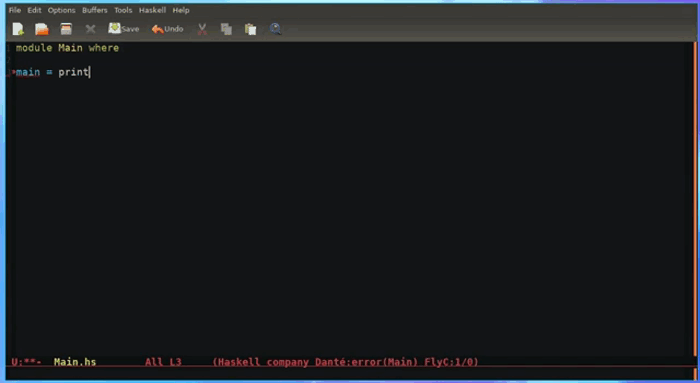

# minimal-haskell-emacs

A minimal emacs configuration for haskell programming using [dante](https://github.com/jyp/dante) and friends.

* Coming from Vim? Try the [evil branch](https://github.com/soupi/minimal-haskell-emacs/tree/evil) which includes vim key bindings

[](https://www.youtube.com/watch?v=Ig5k3UkfvZ4)

[Visit dante's README.org to see the features list for Haskell editing](https://github.com/jyp/dante/blob/master/README.org).

Package management approach is based on [this tutorial](http://y.tsutsumi.io/emacs-from-scratch-part-2-package-management.html).

To get a haskell compiler, I recommend downloading [Stack](https://haskell-lang.org/get-started) and running `stack setup` to install GHC.

To install this configuration, clone the repository and place the following files at your home directory:

- `.emacs` - emacs will call this file first which will trigger the whole thing. Also contains a few convenient tweaks.
- `.emacs.d/my-packages.el` - contains the list of packages to install when starting emacs
- `.emacs.d/my-loadpackages.el` - defines how to enable and setup the packages we use

**WARNING: Backup your changes to all your emacs related files before running the following commands as they will override your files!**

So the steps are:

```
git clone https://github.com/soupi/minimal-haskell-emacs
cp minimal-haskell-emacs/.emacs  ~/
cp -r minimal-haskell-emacs/.emacs.d ~/
```

Now just run Emacs and start hacking!

**Note**: dante has recently changed to stop working with temporary files. There are two ways this can work:

1. Flycheck will save the file all the time without you explicitly saving and you will get flycheck comments on the fly or:
2. You can tell flycheck not the save the file and only see errors when you manually save. To do that uncomment the following lines in `~/.emacs.d/my-loadpackages.el`:

    ```elisp
    (setq flymake-no-changes-timeout nil)
    (setq flymake-start-syntax-check-on-newline nil)
    (setq flycheck-check-syntax-automatically '(save mode-enabled))
    ```

Another approach is to use temp files. You can do that with [this fork][https://github.com/soupi/dante/tree/with-temp-files].

To use temp files, you'll need a couple of extra steps:

1. Install minimal-haskell-emacs the normal way including running emacs and letting it install all of the packages
2. Do the following steps:

    ```
    git clone -b with-temp-files https://github.com/soupi/dante dante-with-temp-files
    rm ~/.emacs.d/elpa/dante*/dante.elc
    cp dante-with-temp-files/dante.el ~/.emacs.d/elpa/dante*/dante.el
    ```

After that when you run emacs you should be able to use dante and get flycheck comments while the buffer is changed but not saved.
